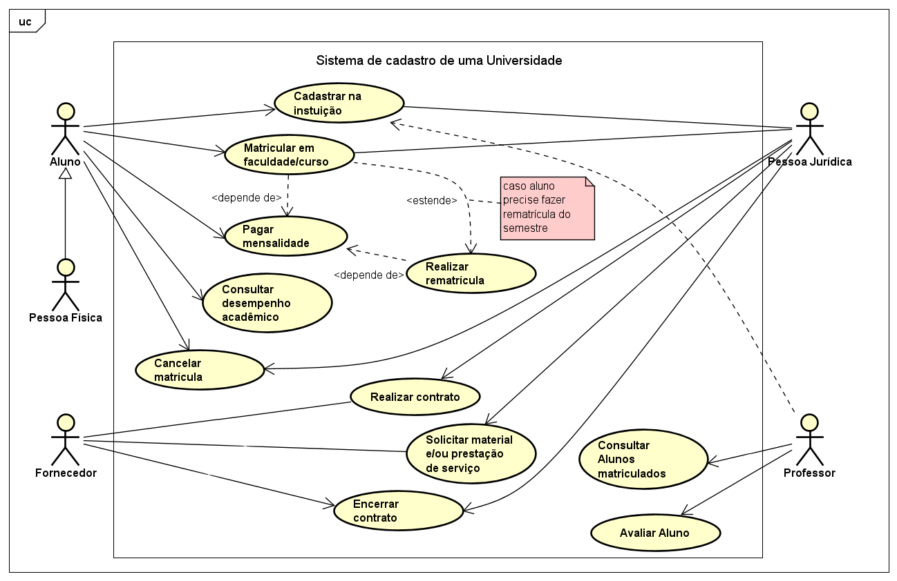
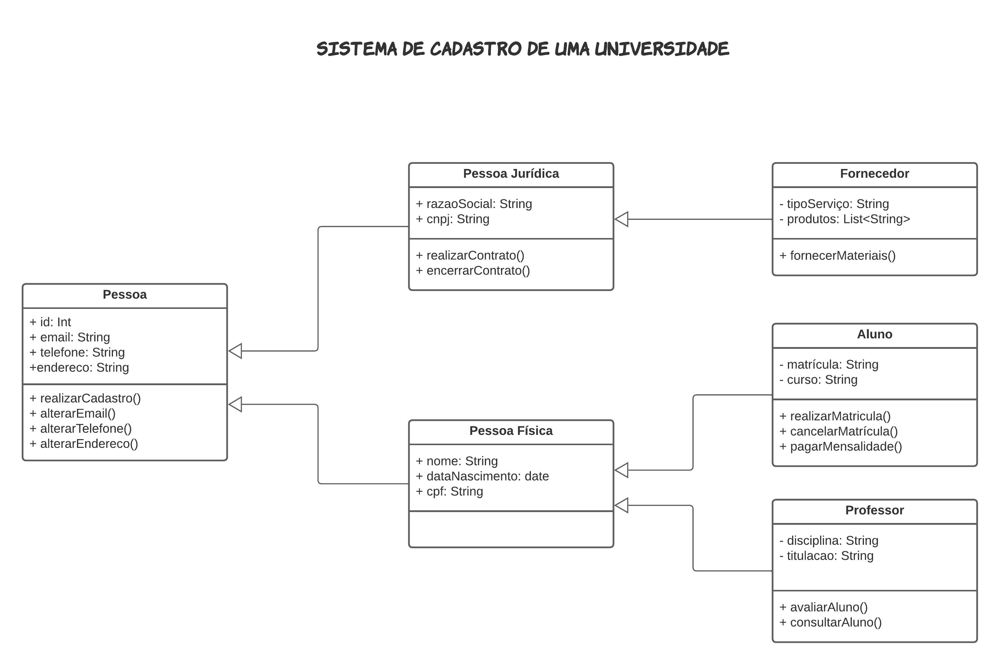
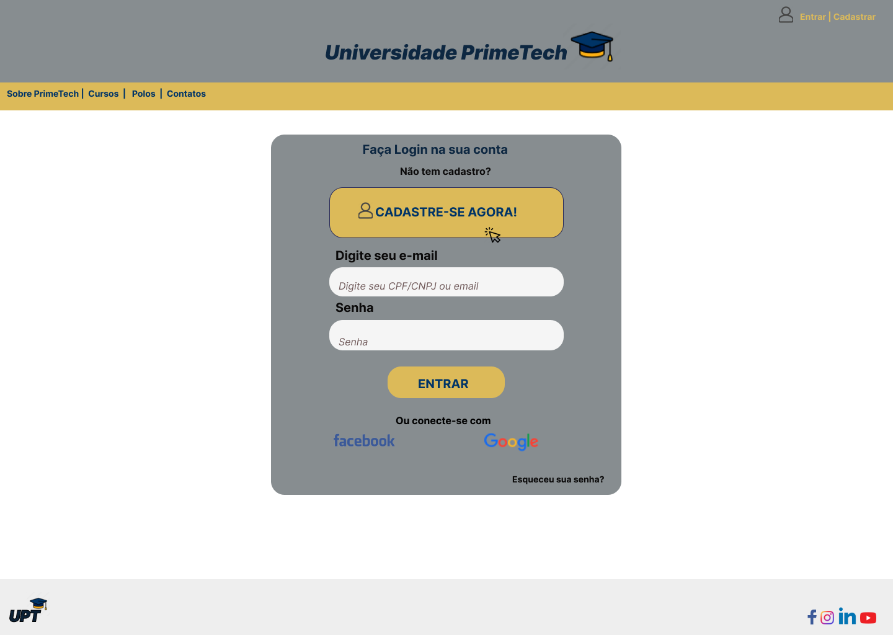
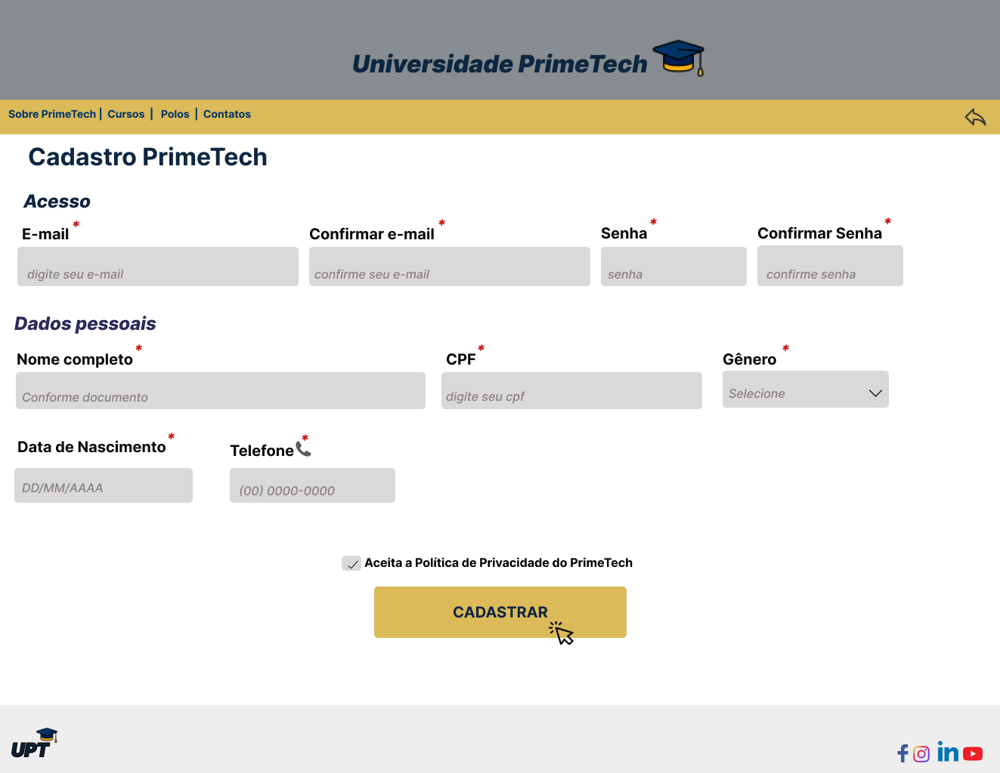
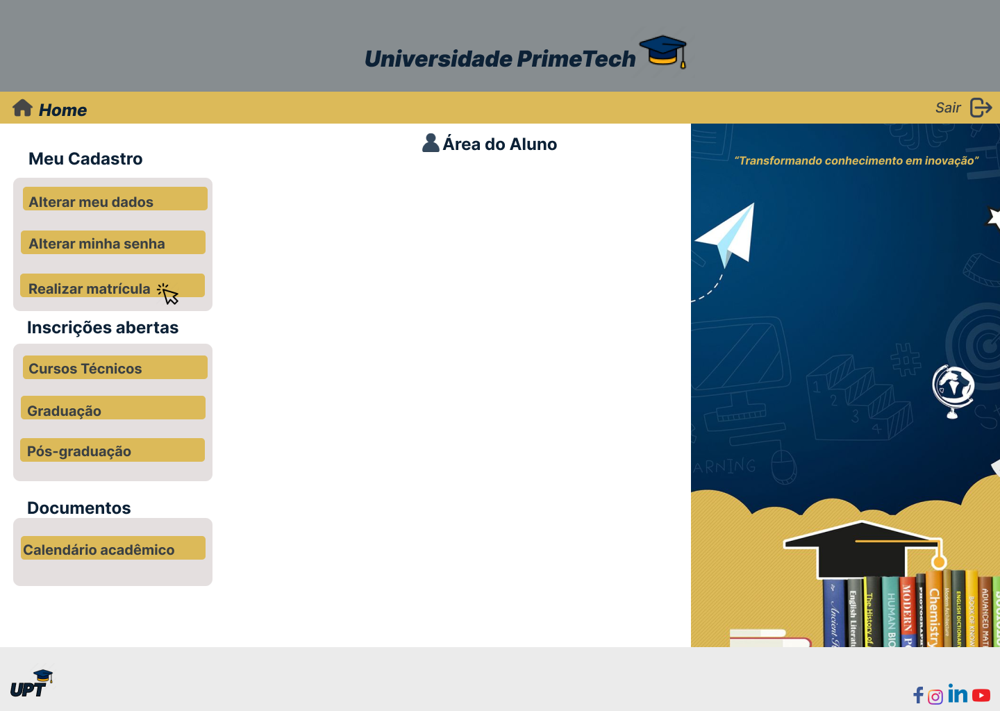
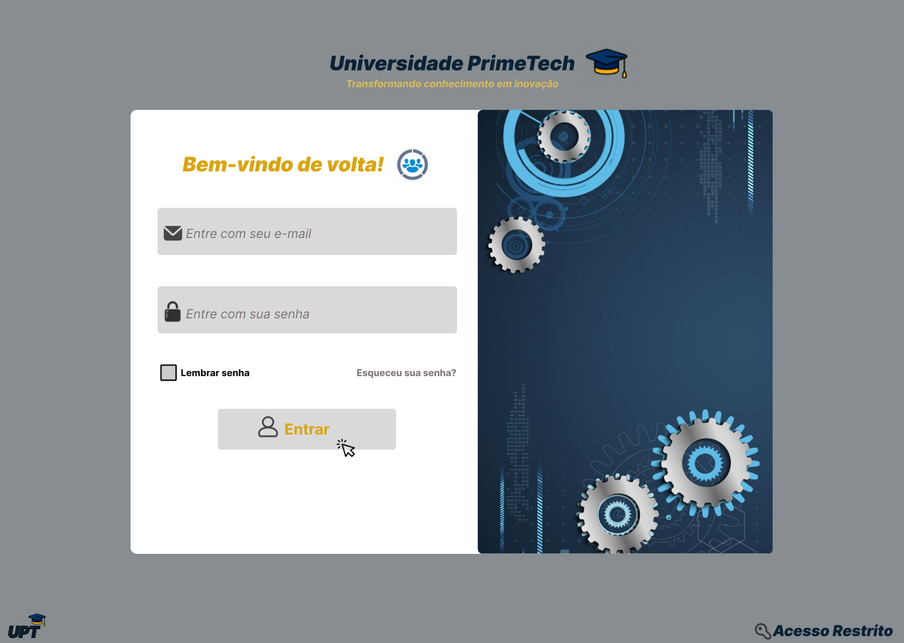
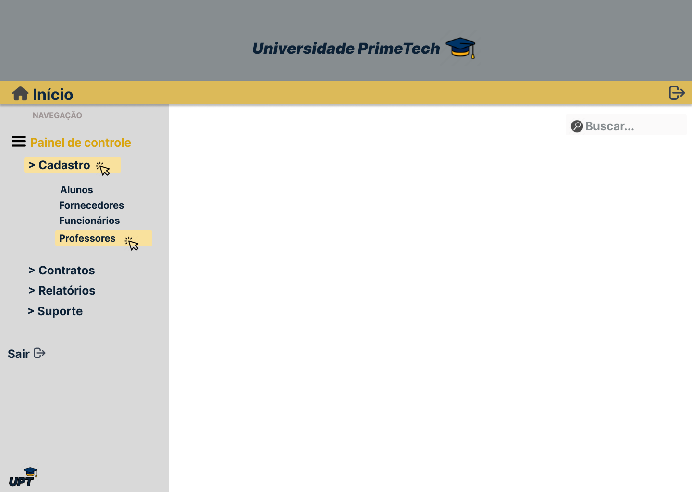
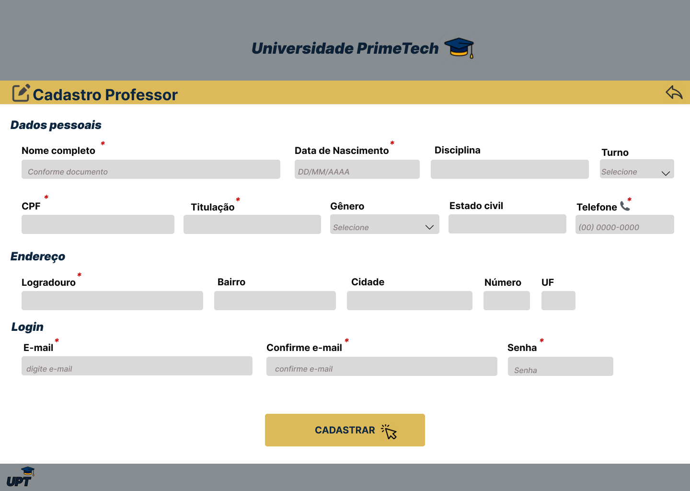
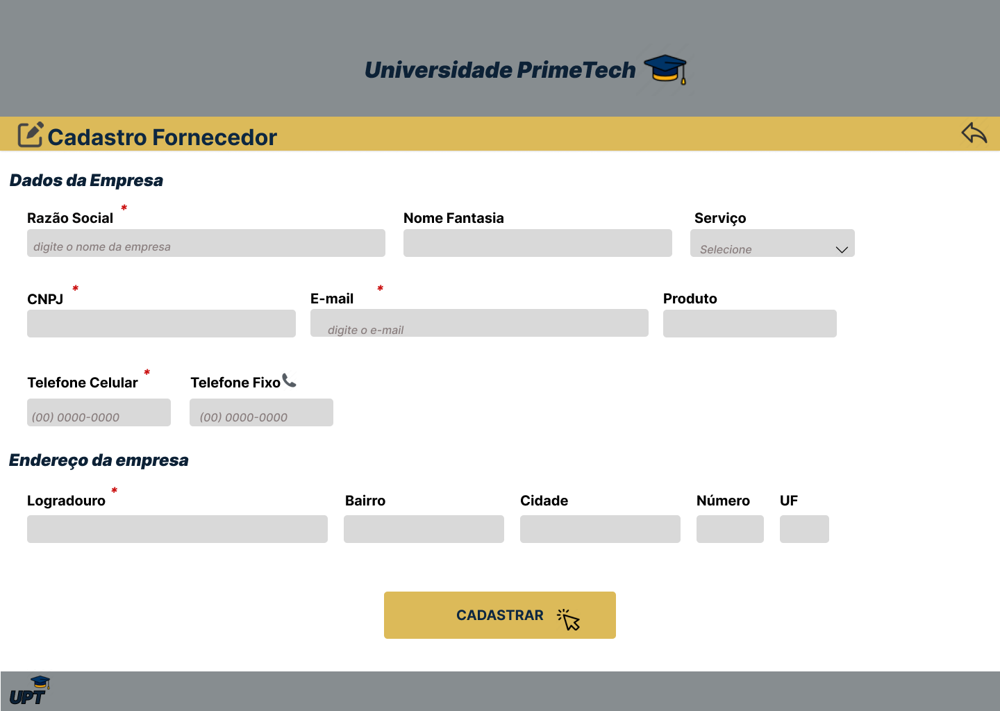

# PROJETO INTEGRADOR III: DESENVOLVIMENTO DE SISTEMAS ORIENTADO À OBJETOS

## Sistema de Cadastro de um Centro Universitário
 

### Integrantes do Grupo
- Andreza Azevedo Gomes de Freitas
- Lucas Vieira Rocha
 

### Resumo
Na primeira fase deste trabalho, apresentamos uma abordagem minuciosa da modelagem de um sistema de gestão de dados em um centro universitário, utilizando a Linguagem de Modelagem Unificada (UML). O foco foi na elaboração de um Diagrama de Casos de Uso que evidencia as principais interações entre os usuários e o sistema, seguido pela descrição dos cenários associados a cada caso de uso. Adicionalmente, introduzimos um Diagrama de Classes que representa a estrutura estática do sistema, identificando as classes principais e seus relacionamentos.

Nesta segunda etapa do Projeto Integrador, elaboramos protótipos das interfaces de cadastro de uma universidade fictícia denominada PrimeTech, utilizando a ferramenta Figma. Estes protótipos têm como objetivo demonstrar de forma prática a visualização das interfaces que serão empregadas pelos usuários no sistema final.

 

## Casos de Uso

 

## Descrição dos Cenários
 

**1 - REALIZAR MATRÍCULA (Pessoa Física);**

 *CENÁRIO PRINCIPAL*

Ator: Pessoa física (aluno ou responsável)

Pré-condição: O ator está cadastrado no sistema.

Descrição: O ator seleciona a opção de realizar matrícula no sistema, fornece as informações necessárias, como dados pessoais, documentos, e confirma a matrícula.

Pós-condição: O sistema exibe uma mensagem que a matrícula foi registrada com sucesso. O ator pode visualizar as informações da matrícula, incluindo detalhes do curso. 

 *CENÁRIO ALTERNATIVO 1 - CANCELAR MATRÍCULA:*

Descrição: O ator opta por cancelar a matrícula durante o processo de registro.

Pós-condição: O processo de matrícula é cancelado, e nenhuma informação é registrada.

 *CENÁRIO ALTERNATIVO 2 - DADOS INCOMPLETOS:*

Descrição: O ator não fornece todas as informações obrigatórias durante o registro de matrícula.

Pós-condição: O sistema exibe uma mensagem de erro e solicita que o ator forneça as informações necessárias para concluir o registro.

**2 - PAGAR MENSALIDADE (Alunos);**

*CENÁRIO PRINCIPAL*

Ator: Alunos
Pré-condição: O aluno deve estar devidamente matriculado em um curso na instituição.

Descrição: O aluno acessa a opção de pagamento da mensalidade. O sistema apresenta as opções de pagamento disponíveis, escolhe a forma de pagamento desejada, e efetua o pagamento.

Pós-condição: O sistema confirma o pagamento e atualiza o status da mensalidade para "pago".

*CENÁRIO ALTERNATIVO 1 – DESISTÊNCIA DO PAGAMENTO:*

Descrição: O aluno interrompe o processo de pagamento.

Pós-condição: A mensalidade permanece como pendente, e o aluno é informado sobre a falta de conclusão do pagamento.

*CENÁRIO ALTERNATIVO 2 – FALHA NO PAGAMENTO:*

Descrição: Durante o pagamento da mensalidade o sistema falhou por qualquer motivo.

Pós-condição: O sistema notifica o aluno sobre a falha no pagamento, a mensalidade permanece como "pendente" se o aluno não concluir o pagamento com sucesso.

**3 - AVALIAR ALUNO (Professores);**

*CENÁRIO PRINCIPAL*

Ator: Professores

Pré-condição: O professor está devidamente autenticado no sistema como professor.

Descrição: O professor acessa a área de avaliação de alunos no sistema, seleciona a turma e o aluno que deseja avaliar, insere as notas correspondentes e adiciona comentários específicos sobre o desempenho do aluno.

Pós-condição: As notas são registradas para o aluno. O sistema atualiza automaticamente as informações, e o aluno pode visualizar as notas e os comentários através de sua conta no sistema.

*CENÁRIO ALTERNATIVO 1 - EXCLUSÃO DE AVALIAÇÃO:*

Descrição: O professor decide excluir completamente a avaliação para o aluno. O sistema exibe uma confirmação para a exclusão, o professor confirma a exclusão da avaliação.

Pós-condição: A avaliação é excluída do sistema. O sistema exibe uma mensagem confirmando a exclusão, e as informações associadas ao aluno retornam ao estado anterior à avaliação.

*CENÁRIO ALTERNATIVO 2 - ALUNO NÃO ENCONTRADO:*

Descrição: O professor tenta registrar notas para um aluno que não está matriculado no sistema.

Pós-condição: O sistema exibe uma mensagem informando que o aluno não foi encontrado.

**4 - REALIZAR CONTRATO (Pessoa Jurídica);**

*CENÁRIO PRINCIPAL*

Ator: Pessoa Jurídica (exemplo: um funcionário autorizado)

Pré-condição: O ator está cadastrado no sistema como Pessoa Jurídica

Descrição: O ator acessa a opção de realizar contrato, fornece as informações necessárias, como detalhes do serviço ou produto contratado, termos e condições, e confirma a criação do contrato.

Pós-condição: O sistema exibe uma mensagem confirmando que o contrato foi registrado com sucesso. As informações do contrato são armazenadas no sistema.

*CENÁRIO ALTERNATIVO 1 – CANCELAR CONTRATO:*

Descrição: O ator opta por cancelar o contrato durante o processo de criação.

Pós-condição: O processo de criação do contrato é cancelado, e nenhuma informação é registrada.

*CENÁRIO ALTERNATIVO 2 – DADOS INCOMPLETOS*

Descrição: O ator não fornece todas as informações obrigatórias durante o processo de criação do contrato.

Pós-condição: O sistema exibe uma mensagem de erro e solicita que o representante forneça as informações necessárias para concluir o registro do contrato.

**5 - FORNECER MATERIAIS (Fornecedor);**

*CENÁRIO PRINCIPAL*

Ator: Fornecedor

Pré-condição: O fornecedor está cadastrado e autorizado no sistema.

Descrição: O fornecedor acessa a opção de fornecer materiais, seleciona o pedido correspondente, fornece as informações necessárias sobre a entrega, e confirma o fornecimento dos materiais.

Pós-condição: O sistema confirma o fornecimento dos materiais, atualiza o status do pedido e armazena as informações da transação.

*CENÁRIO ALTERNATIVO 1 – ATRASO NA ENTREGA:*

Descrição: O fornecedor enfrenta atrasos na entrega dos materiais.

Pós-condição: O sistema notifica automaticamente o responsável pelo pedido sobre o atraso. O status do pedido é atualizado para refletir o atraso na entrega.

*CENÁRIO ALTERNATIVO 2 – MATERIAIS NÃO CONFORMES:*

Descrição: Os materiais fornecidos não atendem às especificações do pedido.

Pós-condição: O sistema registra a não conformidade, notifica o fornecedor e o responsável pelo pedido. O status do pedido é atualizado para refletir a situação, e são iniciadas as ações corretivas necessárias.

 

## Diagrama de Classes

 

# Telas 
## Aluno
- Login do Aluno: Apresenta campos para inserção de email e senha, permitindo acesso à Área do Aluno. Também inclui um botão de 'CADASTRE-SE AGORA' para novos usuários que ainda não possuem cadastro na universidade.
 

 

- Cadastro-Aluno: Solicita os dados importantes para o cadastro no sistema.

 
 
 

- Área-Aluno: Acesso a documentos, cursos e matrícula.

 

## Gestor
- Login-Gestor: Requer email e senha para autenticação, garantindo acesso restrito exclusivamente aos gestores do sistema.

 

- Painel-Controle-Gestão: Permite acesso aos dados cadastrais de alunos, professores, funcionários e fornecedores. Além de fornecer informações sobre contratos, relatórios e contato direto com o suporte.

 
 
 

## Professor
- Cadastro-Professor: Solicita dados para o Professor ser cadastrado no sistema.

 

## Fornecedor
- Cadastro-Fornecedor: Solicita dados para o Fornecedor ser cadastrado no sistema.

 

> [!NOTE]
> Documentação em andamento...

